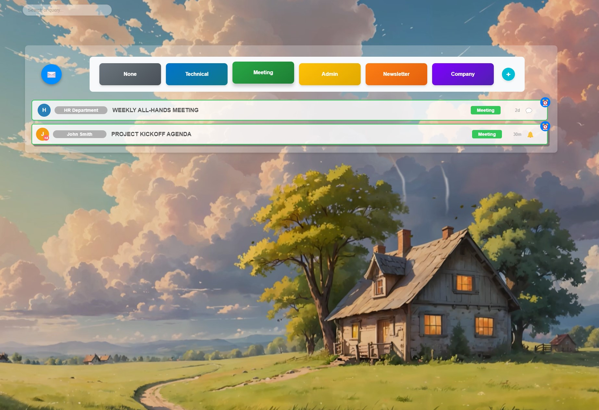
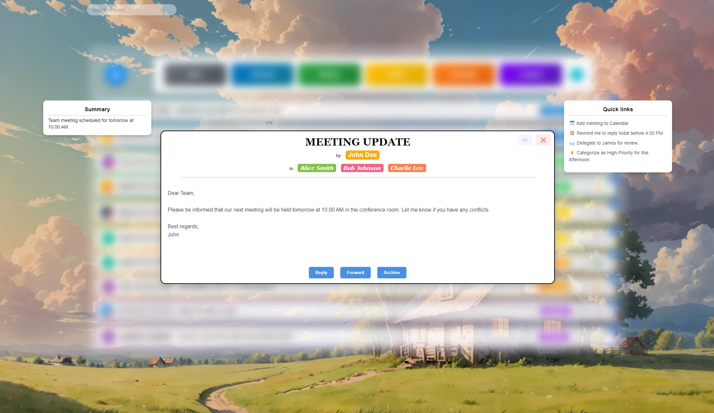

*A vibrant, sensory-rich webmail experience*

# **LofiMail: Open-Source Webmail Redefined**

### ✨ **Beautiful. Collaborative. Non-Profit.**

Welcome to **LofiMail**, an open-source webmail application dedicated to creating a modern, elegant, and accessible webmail application. 
Featuring a modern, uncluttered design, colorful visual cues and integrated also sound features, it ensures every interaction is intuitive and engaging.
Our mission is to deliver an intuitive email experience while fostering a global community of developers, designers, and enthusiasts.


<p align="center">
  
</p>

---

## 🌟 **Why LofiMail?**

- **🚀 Sleek and Modern Design**: Enjoy a clean, responsive UI designed for productivity.  
- **🤝 Community-Driven**: Built by contributors from all over the world.  
- **🔓 100% Open Source**: Transparent, free to use, and free to improve.  
- **🌍 Non-Profit Vision**: Focused on empowering users, not monetizing them.  

Join us to craft the future of email management!


<p align="center">
  
</p>

---

## 📋 **Features**

- **Quick Search**: Discrete, fast, and powerful search functionality.  
- **Category Tiles**: Filter emails with visually stunning tag tiles. 
- **Customizable Themes**: Personalize your webmail interface.   
- **Email Snoozing**: Manage your inbox your way.  
- **Collaborative Enhancements**: Suggest new features or integrations!

---

## 🤝 **Contributing**

We welcome developers, designers, writers, and testers! Follow these steps to start contributing:

1. **Fork the Repository**: Click on the "Fork" button to create your copy.  
2. **Clone the Repo**:  
   ```bash
   git clone https://github.com/your-username/LofiMail.git
   ```
3. **Install Dependencies**:  
   ```bash
   npm install  # Or use pip if it's Python-based.
   ```
4. **Start Developing**:  
   Open a feature branch, submit pull requests, and join our discussions.

Check out the [Contributing Guide](CONTRIBUTING.md) for detailed instructions.

---

## 🌍 **Join the Community**

- **GitHub Discussions**: Share ideas and collaborate.  
- **Slack Channel**: Real-time chats with contributors.  
- **Twitter**: Follow us for updates!  
- **Weekly Stand-Ups**: Join our virtual calls to discuss progress.

---

## 📜 **License**

LofiMail is licensed under the [MIT License](LICENSE), ensuring the freedom to use, modify, and distribute the project.

---

## 🎯 **Roadmap**

We’re building a bright future for Mailflow. Here’s what’s next:

- **Implementation from  mockup**  
- **Integration with IMAP/SMTP servers**  

---

## 🙌 **Acknowledgments**

A big thank you to all contributors who make this project possible. Together, we’re transforming webmail!

---

## 🌟 **Start Contributing Today!**

Click the ⭐ **Star** button if you believe in our vision. Fork the repo, share your ideas, and let’s build something extraordinary together.

---

Does this README reflect the spirit of your project? Would you like me to tailor specific sections or add more details?
