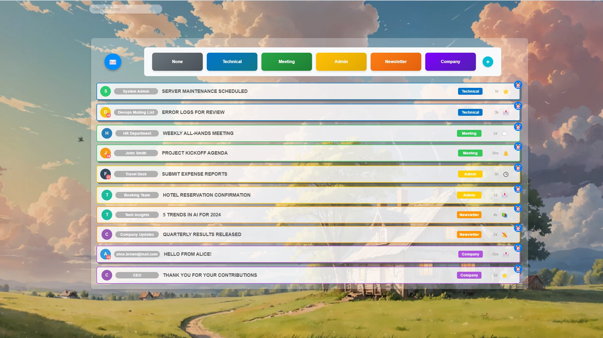
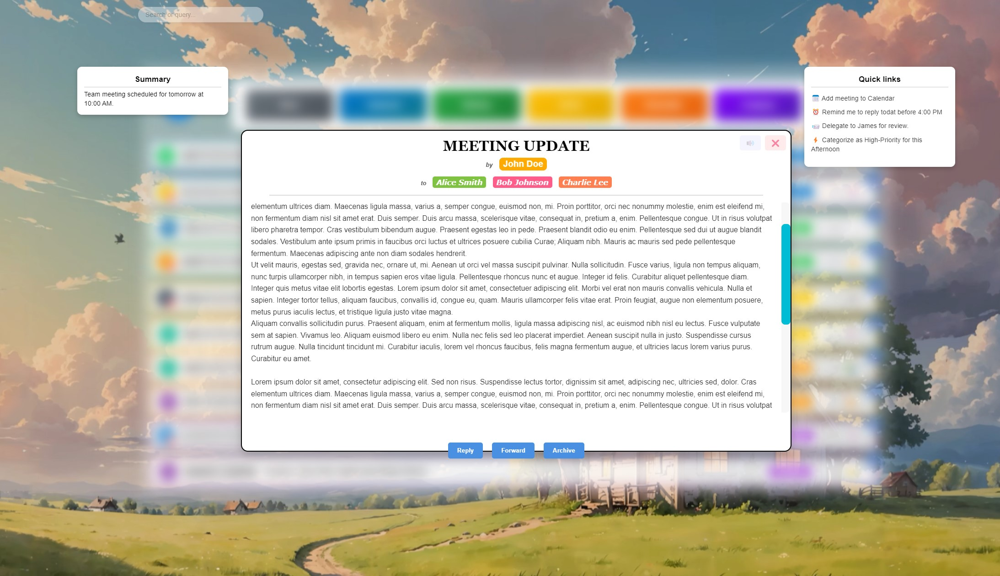
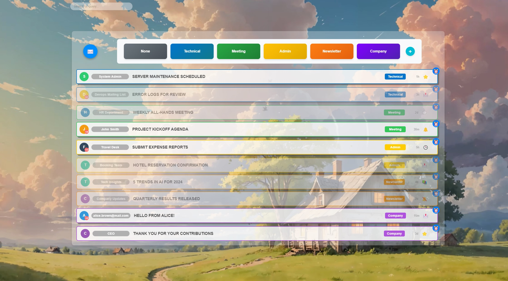

  Below is a screenshot of the  list of mails.
  

Below is a screenshot of  the display of a single mail.
  

Below is a screenshot of  the display of a sigle long mail.
  

    You can filter out the mails, displaynig only the one from the considered category.
    

Some mails can be made transparent.   
  

